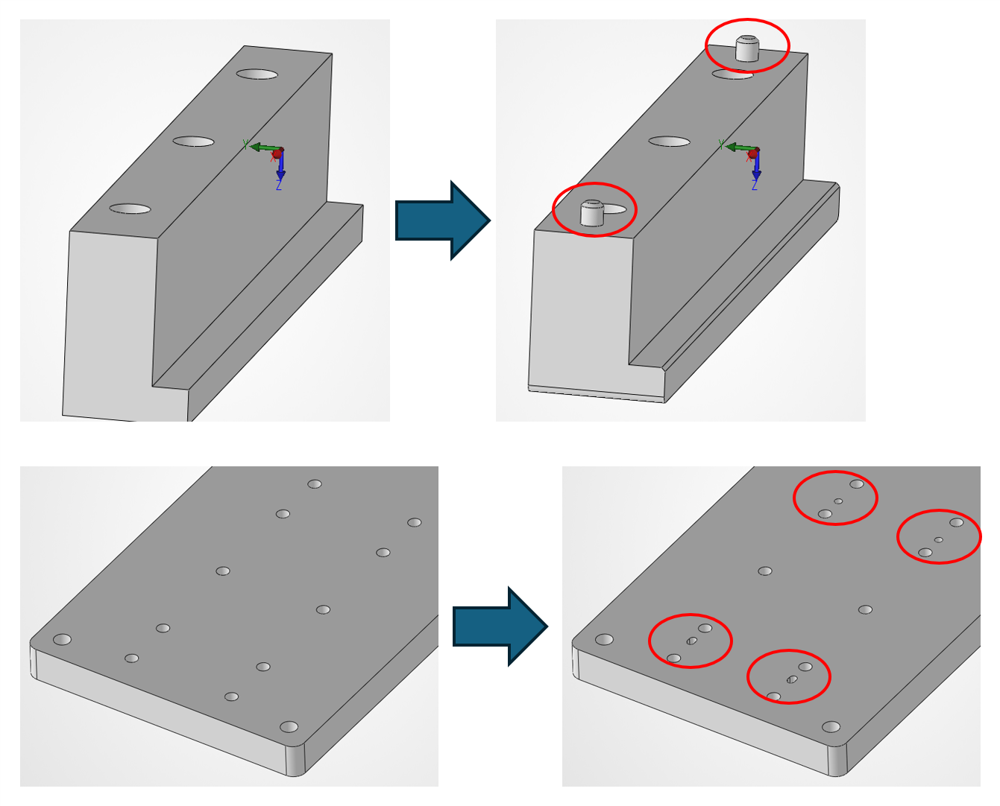
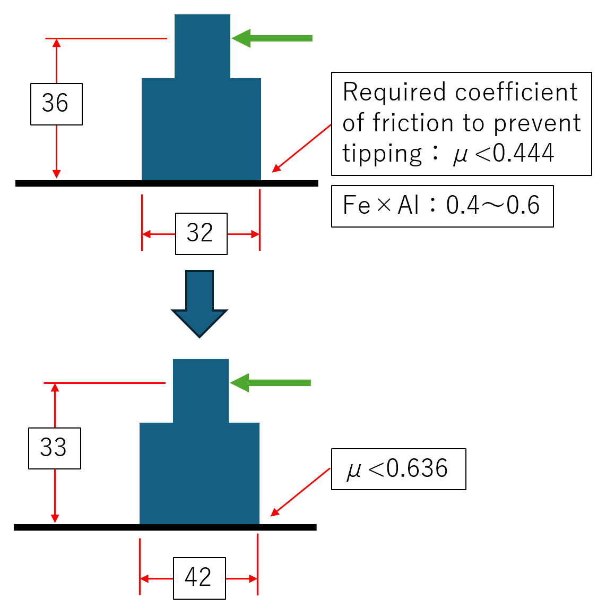
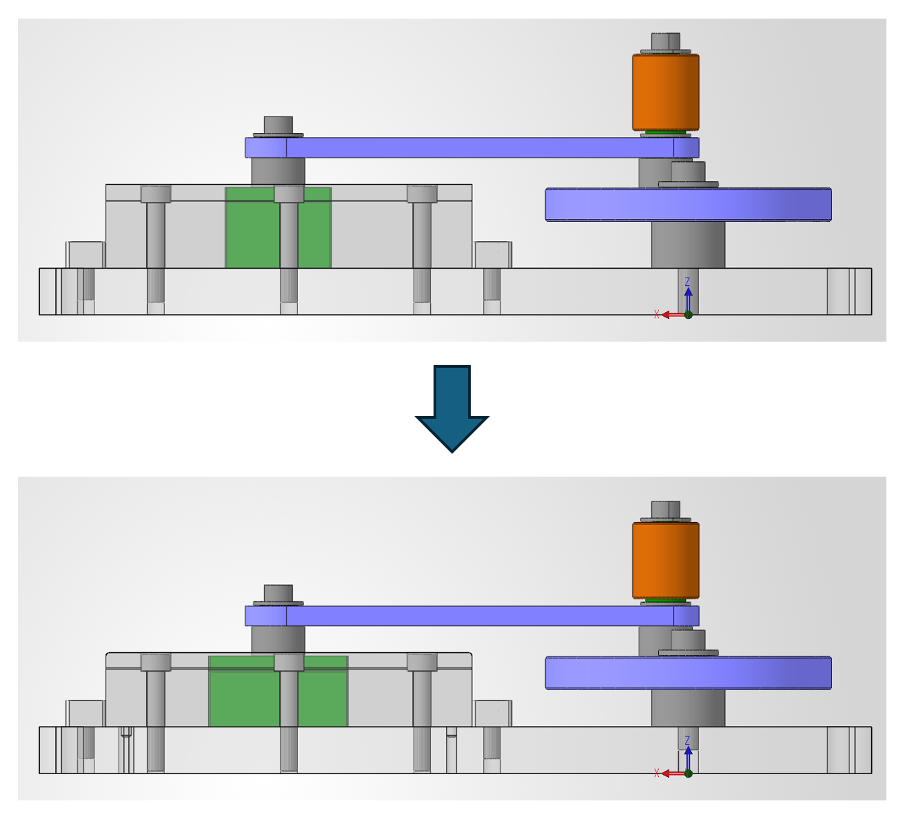

# Crank Mechanism: Proposed Design Improvements

The observations and proposed improvements in this document are based on feedback from a human expert.

This document presents the improvements identified in the supplied design review: more reliable guide rail positioning and smoother slider motion. The figures compare the current design with the proposed changes.

## 1. Improved Guide Rail Positioning

**Objective:** Improve the positioning of the guide rails during assembly.

The proposed design adds two locating pins to each guide rail, one near each end. Matching holes in the base locate both guide rails, with four locating holes in total. The red circles highlight the added locating features.

*Figure 1. Guide rail and base modifications. Left: current design. Right: proposed design.*

## 2. Improved Slider Motion and Galling Prevention

**Objective:** Improve slider motion and prevent galling by revising the slider geometry.

The proposed comparison increases the slider's contact length in the direction of travel and lowers the point where the horizontal force acts. The source gives the following dimensions and friction coefficient limits for preventing tipping.

| Parameter | Current Design | Proposed Design |
|---|---:|---:|
| Slider contact length in the direction of travel | 32 | 42 |
| Height of the horizontal force above the sliding surface | 36 | 33 |
| Friction coefficient condition for preventing tipping | μ < 0.444 | μ < 0.636 |

*Linear dimensions are in millimeters, following the project's dimensional convention. μ denotes the coefficient of friction.*

The source lists a friction coefficient range of **0.4–0.6 for Fe–Al contact**. The proposed geometry raises the stated limit from **0.444 to 0.636**. These friction values and the material pairing are reproduced from the source comparison.

*Figure 2. Slider geometry comparison. Top: current design. Bottom: proposed design. Green arrows show the applied horizontal force.*

## 3. Assembly Comparison

The side views show the proposed changes in the assembled mechanism. The revised view shows a longer slider and a lower guide and linkage arrangement.

*Figure 3. Assembly comparison. Top: current design. Bottom: proposed design.*

## Source

Supplied PowerPoint presentation, “Areas Requiring Improvement,” slides 1–3. The figures retain the original geometry, annotations, and comparison order. Descriptions of features shown only in the figures are based on visual interpretation.
