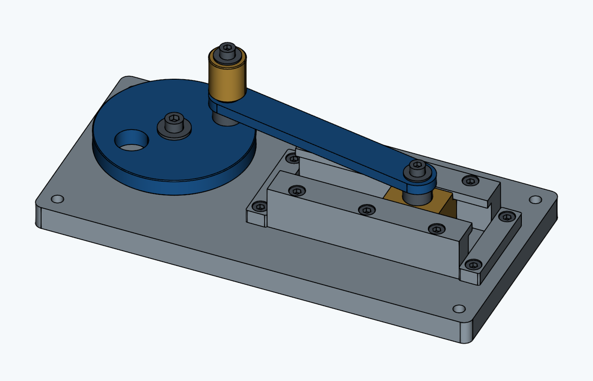

# Educational Slider–Crank Mechanism (Machined Metal Parts)



This hand-operated tabletop teaching aid was created using CadQuery code generated by GPT-6 Astra. It has a crank radius of 30 mm, a connecting rod center-to-center distance of 120 mm, and a stroke of 60 mm. The design combines an aluminum base, guides, and connecting rod with brass sliding components and steel shafts.

## Deliverables

- [Assembly STEP](output/assembly.step): Shown at 45°. Contains 33 independent solids with part names and colors.
- [Custom-made part STEP files](output/parts/): 14 types, with a total of 20 pieces to manufacture.
- [Commercial screw reference STEP files](output/hardware_reference/): 5 types, totaling 13 screws. Thread geometry is omitted.
- [3D preview](output/preview.html): Download the file and open it in a WebGL-capable browser to change the viewpoint and inspect the mechanism's motion. No internet connection is required after downloading.
- [Assembly image](output/assembly_preview.png) / [Top view image](output/assembly_top.png): Rendered views of the CAD model.
- [Machining specifications and assembly procedure](DESIGN_EN.md), [Bill of materials](output/BOM_EN.md), and [Dimensions and quantities in JSON](output/manifest.json).
- [Interference check results](output/motion_check.json): 24 positions at 15° increments.

The files in `output/hardware_reference/` are generic screw reference models generated by `socket_screw()` in `crank_model.py`, rather than CAD files downloaded from a manufacturer. They are simplified models for placement and clearance checks, with threads omitted. They do not certify the dimensions or performance of a particular manufacturer's product. Select actual screws according to `DESIGN_EN.md`.

## Regeneration

Use Python 3.11 and run the commands from the project root. Create a virtual environment:

```sh
python -m venv .venv
```

Activate it in Windows PowerShell:

```powershell
.\.venv\Scripts\Activate.ps1
```

Or activate it in a macOS/Linux shell:

```sh
source .venv/bin/activate
```

Install the dependencies, generate the files, and run the tests:

```sh
python -m pip install -r requirements.txt
python -X utf8 crank_model.py --check-motion
python -X utf8 -m pytest -q -p no:cacheprovider --basetemp .pytest_tmp
```

Generated files are saved to this project's `output` directory by default. Dependency versions are pinned in `requirements.txt` for reproducibility. When changing dependency versions, rerun generation and tests and check that both commands exit successfully.

```sh
# Change only the angle and write the results to a separate folder
python -X utf8 crank_model.py --angle 180 --output output_180 --check-motion

# Reuse the base and change the radius to 25 mm (50 mm stroke)
python -X utf8 crank_model.py --radius 25 --rod-length 120 --output output_r25 --check-motion
```

The supported radius range is 24–35 mm. The conditions `L-r >= 84` and `L+r <= 156` are also checked for connecting rod center-to-center distance L and crank radius r. The dimension tables in the machining specifications apply to the default 30/120 mm design. When changing the design, update those tables to match the generated STEP files and manifest values.

## Code and Verification

- `crank_model.py`: Dimension definitions, 19 types of part geometry, assembly placement, STEP export, and solid interference checks.
- `preview.py` / `templates/preview.html`: A self-contained 3D viewer using triangulated versions of the same CadQuery geometry.
- `render_model.py`: Run `python render_model.py` to generate verification images of the default design.
- `checks/test_crank_model.py`: Checks solid validity, motion at 1° increments, interference at 24 positions, thread engagement, and STEP reimport.
- `pyproject.toml`: Pytest configuration, including the test discovery directory.

The mechanism equation is `x = r*cos(theta) + sqrt(L^2 - r^2*sin(theta)^2)`. STEP files contain static geometry; they do not transfer motion constraints to other CAD applications.

The STEP files represent nominal dimensions. **Follow DESIGN_EN.md for machining instructions**, including threads and press-fit tolerances. Verification covers the nominal geometry; friction, wear, and strength testing on a physical mechanism have not been performed.

The CAD-rendered images linked above were used for visual geometry checks. The HTML viewer's screen layout and interactions have not yet been verified.

CadQuery API reference: [Official STEP import/export documentation](https://cadquery.readthedocs.io/en/latest/importexport.html).

## Repository Contents and License

The repository includes source code, test code, dependency and test configuration, design documentation, and the standard design's STEP files, preview, images, bill of materials, and verification data. `.gitignore` excludes virtual environments, caches, temporary files, development notes, alternative `output_*` directories, and distribution archives. Within `output/`, only the listed deliverables and part STEP files are included.

This project is distributed under the [MIT License](LICENSE). Third-party dependencies retain their respective licenses.

---

# 教育用スライダ・クランク機構（切削金属部品）

GPT-6 Astraで生成したCadQueryコードで作成した、手回し式の卓上教材です。クランク半径30 mm、連接棒軸間120 mm、ストローク60 mm。アルミのベース・ガイド・リンク、黄銅の摺動部、鋼の軸を組み合わせます。

## 成果物

- [組立STEP](output/assembly.step)：45°の姿勢。部品名・色を含む33個の独立ソリッド。
- [製作部品STEP](output/parts/)：14種類、合計20個を製作。
- [市販ボルト参考STEP](output/hardware_reference/)：5種類、合計13本。ねじ山を省略。
- [3Dプレビュー](output/preview.html)：ファイルをダウンロードしてWebGL対応ブラウザーで開くと、視点変更と動作確認ができます。ダウンロード後はインターネット接続不要です。
- [組立画像](output/assembly_preview.png) / [平面図画像](output/assembly_top.png)：CADモデルの描画画像。
- [加工仕様・組立手順](DESIGN.md)、[部品表](output/BOM.md)、[寸法・数量JSON](output/manifest.json)。
- [干渉検証結果](output/motion_check.json)：15°刻みの24姿勢。

`output/hardware_reference/`は、`crank_model.py`の`socket_screw()`で生成した汎用ねじの参考モデルであり、メーカーからダウンロードしたCADデータではありません。ねじ山を省略した配置・すきま確認用の簡略形状で、特定メーカー製品の寸法や性能を保証するものではありません。実際のねじは`DESIGN.md`に従って選定してください。

## 再生成

Python 3.11を使用し、プロジェクトのルートでコマンドを実行します。まず仮想環境を作成します。

```sh
python -m venv .venv
```

Windows PowerShellでは、次のコマンドで有効化します。

```powershell
.\.venv\Scripts\Activate.ps1
```

macOS/Linuxのシェルでは、次のコマンドで有効化します。

```sh
source .venv/bin/activate
```

依存パッケージをインストールし、ファイル生成とテストを実行します。

```sh
python -m pip install -r requirements.txt
python -X utf8 crank_model.py --check-motion
python -X utf8 -m pytest -q -p no:cacheprovider --basetemp .pytest_tmp
```

ファイルの生成先は既定でこのプロジェクトの`output`です。再現性を確保するため、依存パッケージのバージョンを`requirements.txt`で固定しています。バージョンを変更する場合は、生成とテストを再実行し、両方のコマンドが正常終了することも確認してください。

```sh
# 姿勢だけを変えて別フォルダーに出力
python -X utf8 crank_model.py --angle 180 --output output_180 --check-motion

# ベースを共用して半径を25 mm（ストローク50 mm）に変更
python -X utf8 crank_model.py --radius 25 --rod-length 120 --output output_r25 --check-motion
```

変更可能な半径は24～35 mmです。連接棒軸間Lと半径rについて`L-r >= 84`、`L+r <= 156`も検証します。加工仕様書の寸法表は既定の30/120 mm用なので、変更時は生成したSTEP・manifestの値と併せて更新してください。

## コードと検証

- `crank_model.py`：寸法定義、19種類の部品形状、組立配置、STEP出力、実体干渉判定。
- `preview.py` / `templates/preview.html`：同じCadQuery形状を三角形化した、外部通信不要の3Dビューア。
- `render_model.py`：`python render_model.py` で既定設計の確認画像を生成。
- `checks/test_crank_model.py`：ソリッドの健全性、1°刻みの運動、24姿勢の干渉、ねじの掛かり、STEP再読込を検証。
- `pyproject.toml`：テストの探索先などのpytest設定。

機構の式は `x = r*cos(theta) + sqrt(L^2 - r^2*sin(theta)^2)`。STEPは静的な形状であり、他のCADに動作拘束が転送される形式ではありません。

STEPは公称寸法のモデルです。ねじと圧入公差を含む加工指示は **DESIGN.mdを優先**してください。公称形状の検証までを実施しており、実機の摩擦・摩耗・強度試験は未実施です。

形状の目視確認には上記のCAD描画画像を使用しました。HTMLビューアの画面・操作確認は未実施です。

CadQuery APIの出典：[公式STEP入出力ドキュメント](https://cadquery.readthedocs.io/en/latest/importexport.html)。

## 公開ファイルとライセンス

ソースコード、テストコード、依存関係・テスト設定、設計資料、および標準設計のSTEP・プレビュー・画像・部品表・検証データを公開対象としています。仮想環境、キャッシュ、一時ファイル、開発用メモ、別条件の`output_*`フォルダー、配布用アーカイブは`.gitignore`で除外します。`output/`内は、指定した成果物と部品STEPのみを対象とします。

本プロジェクトは[MIT License](LICENSE)で公開します。依存する第三者ライブラリには、それぞれのライセンスが適用されます。
